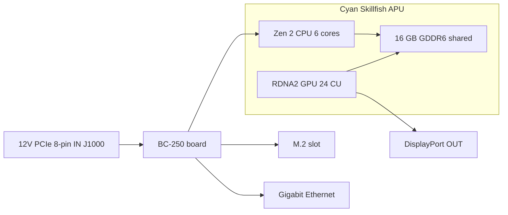

# What Is the BC-250

> **TL;DR** — The BC-250 is a **PlayStation 5-class APU on a server/mining board**. One chip (AMD codename **Cyan Skillfish**, a cut-down version of the PS5's **Oberon/Ariel** silicon) carries a **6-core / 12-thread Zen 2 CPU** and a **24-compute-unit RDNA 2 GPU**, fed by **16 GB of soldered GDDR6**. It is **not a graphics card and not a normal PC** — it has **no x86 BIOS you know, no PCIe slot, no 24-pin ATX plug**: it takes **12 V straight into an 8-pin PCIe power connector** and boots its own firmware. People buy it because it's a **dirt-cheap Linux gaming / local-AI box**. People rage at it because the **drivers, cooling, and lack of hardware video encoding** make it a project, not a plug-and-play machine. If you want zero hassle, this board is the wrong purchase — return it now. If you like tinkering, read on.

This page is the "what did I actually buy" reference. Power, cooling, OS install and drivers each get their own section ([03](03-power-supply.md) / [04](04-cooling.md) / [06](06-linux.md)).

---

## What it actually is

AMD built the BC-250 as a **cryptocurrency mining accelerator** (the "BC" stands for blockchain). To make it cheap, AMD reused **leftover PlayStation 5 processor silicon** — the same family of chip Sony puts in the console. A board is one APU plus its memory and power circuitry; that's the whole product.

Jargon, defined once:

- **APU** (Accelerated Processing Unit) — AMD's name for a single chip that contains **both the CPU and the GPU**. There is no separate graphics card; the GPU is inside the same package, sharing the same memory.
- **Cyan Skillfish** — AMD's engineering **codename** for this APU. You'll see it everywhere in Linux: the GPU firmware file is literally `cyan_skillfish_gpu_info.bin` ([src](https://t.me/c/2424231195/57962) — see the symlink fix at [src](https://t.me/c/2424231195/41252)). Tools may also report it under the PS5 die names **Oberon** / **Ariel**.
- **GDDR6** — the fast graphics memory normally found on a video card. On the BC-250 it's the **system RAM and the video RAM at the same time** (the CPU and GPU share one pool). There are no DIMM slots; the 16 GB is soldered down and not upgradeable.
- **RDNA 2** — the GPU architecture generation (same family as the PS5, Xbox Series, and Radeon RX 6000 cards).

The chip is a **cut-down** PS5 part, not the full one. The community pinned this comparison ([src](https://t.me/c/2424231195/11282), citing [TechPowerUp's Oberon entry](https://www.techpowerup.com/gpu-specs/amd-oberon.g936)):

| | BC-250 | Full PS5 (Oberon) |
|---|---|---|
| CPU cores / threads | **6 / 12** | 8 / 16 |
| GPU compute units (CU) | **24** | 36 |

A "compute unit" is one GPU core block; 24 of them is roughly mid-range-laptop-GPU territory, which is exactly the performance bracket the chat reports in games.

The BC-250 isn't AMD's only "leftover console silicon on a desktop board." It has two close cousins built from the same idea: the **AMD 4700S Desktop Kit** (a **PlayStation 5**-derived CPU kit) — which the chat warns gets cross-listed against the BC-250 on marketplaces ([02-buying.md](02-buying.md)) — and the **AMD 4800S Desktop Kit**, the **Xbox Series X**-derived version (8 Zen 2 cores wired to GDDR6, with the console's RDNA 2 GPU fused off). Both are real AMD products that, like the BC-250, pair a salvaged console CPU with soldered GDDR6 ([VideoCardz](https://videocardz.com/newz/amd-4800s-desktop-kit-a-pc-repurposed-apu-from-xbox-series-x-has-been-tested)). They're useful context for telling the BC-250 apart from its siblings when you shop.

People have run **desktop Linux on the BC-250 the same way the PS5 itself was jailbroken** — full 4K HDMI video + audio, all USB ports working, the APU clocking up to ~3.2 GHz on the CPU and ~2.0 GHz on the GPU ([src](https://t.me/c/2424231195/122260)).

---

## What it's good at

- **The cheapest way into Linux gaming at this performance tier.** Through Steam/Proton (a compatibility layer that runs Windows games on Linux) people play Star Citizen ([src](https://t.me/c/2424231195/38702)), and even modern titles like *Doom: The Dark Ages* via a community Vulkan wrapper at ~60 FPS on low/FSR ([src](https://t.me/c/2424231195/127696)). Per-game results live in [11-gaming.md](11-gaming.md).
- **A capable local-AI box.** With 16 GB of GDDR6 it can hold mid-size language models. Members run LLMs locally through `llama.cpp`/`jan` on the **Vulkan** backend; you set the BIOS to allocate 12 GB to the GPU first ([src](https://t.me/c/2424231195/92421)). See [12-ai-llm.md](12-ai-llm.md).
- **Tiny and self-contained.** It's a single long board with the GPU-style heatsink built in — it drops into small DIY/3D-printed cases and runs off one small power supply ([build src](https://t.me/c/2424231195/137825)).

The community consensus on *why* it works at all: because the chip is so close to the Steam Deck / PS5 hardware, Valve and the open-source Mesa graphics stack keep improving the exact same drivers, so the BC-250 rides along for free ([src](https://t.me/c/2424231195/93006)).

---

## What's painful (set expectations)

This is the half newcomers underestimate. None of it is a dealbreaker, but all of it is real work.

- **Drivers are a do-it-yourself job.** AMD ships **no official driver and no public documentation** for this board ([src](https://t.me/c/2424231195/37764)). Everything — the Linux graphics stack, the clock/voltage "governor", the BIOS — is community-built. Expect to follow setup scripts and occasionally fix things by hand. Start at [06-linux.md](06-linux.md).
- **Cooling is the #1 thing people get wrong.** The stock heatsink was designed for a mining rack's forced-air tunnel, so on a desk it overheats and throttles out of the box. You will need to mod the cooling. This has its own section — read [04-cooling.md](04-cooling.md) **before** chasing performance.
- **No hardware video encoder.** The GPU's video-encode block (what AMD calls **VCN** — the dedicated circuit that compresses video for streaming/recording) is **not available**. Screen recording and game streaming fall back to a **software encoder**, which costs CPU. It works (people stream over Sunshine/Moonlight) but it's slower and lower-quality than a normal GPU ([src](https://t.me/c/2424231195/88026)). Likewise, the early Mesa driver was famously **software rendering** until the community got hardware acceleration working ([src](https://t.me/c/2424231195/11243)).
- **Weird power and no display by default.** It does not take a standard 24-pin ATX connector — see the next section. Many boards also arrive needing a **BIOS reset** before they'll even POST ([src](https://t.me/c/2424231195/57930)), and you usually output picture over **DisplayPort** (HDMI needs a DP→HDMI adapter, which also carries audio fine — [src](https://t.me/c/2424231195/9148)).
- **It's a tinkerer's board, period.** As one long-time member put it: despite being cheap, the BC-250 "requires certain skills, effort and brains" ([src](https://t.me/c/2424231195/73002)). Budget time, not just money.
- ⚠ **An eGPU won't rescue it — community-reported (r/BC250Gaming).** The single M.2 slot is only **PCIe 2.0 ×2** (see the hardware card below), and at that bandwidth an external GPU hung off the M.2 is **reported to perform *worse* than the onboard RDNA 2 GPU** — the slow link strangles it. If you want more graphics power, the consensus is this isn't the board for it. *(Community-reported; treat as a caution, not a benchmark.)*

> ⚠ **What the bicolor LED means — community-reported (r/BC250Gaming).** The two-colour LED next to the NIC is a **mining-era utilization indicator, not an error light**: by community accounts **red = the GPU/RAM is *not* at 100 % utilization, green = full utilization**. So a red light on an idle desktop board is normal, not a fault. *(Community-reported; AMD ships no documentation for this board, so treat the exact colour mapping as unconfirmed.)*

> ⚠ **Handling warning, learned the hard way.** Do **not** let anything metallic touch the powered board, and only ever swap the thermal paste with care — a member permanently killed their BC-250 by shorting it ([src](https://t.me/c/2424231195/95998)). Boards also ship slightly **bent** from the heatsink mounting; one member fixed a no-boot by shimming the board flat against the heatsink with paper ([src](https://t.me/c/2424231195/117347)).

---

## Hardware Reference Card

Specs are cross-checked against the community hardware reverse-engineering (AMD publishes no datasheet). Memory-bus and physical-dimension figures, previously unconfirmed, are now sourced from the [elektricM hardware spec](https://github.com/elektricm/elektricm) (which credits mothenjoyer69 / Segfault / neggles / yeyus for the reverse-engineering). The pinout and power figures below come from the canonical community hardware doc.

The board at a glance — power in on the left, the APU and its shared memory in the middle, I/O on the right:



### Core specs

| Spec | Value | Source |
|------|-------|--------|
| Class | PlayStation 5-derived APU on a mining/server board | [hardware.md](https://github.com/mothenjoyer69/bc250-documentation/blob/main/hardware.md) |
| APU codename | **Cyan Skillfish** (PS5 die: Oberon / Ariel) | chat ([src](https://t.me/c/2424231195/57962)) |
| CPU | **6 cores / 12 threads, Zen 2** (6 cores confirmed) | [hardware.md](https://github.com/mothenjoyer69/bc250-documentation) · chat ([src](https://t.me/c/2424231195/11282)) |
| CPU clock | up to **~3.49 GHz** ("ish") | [hardware.md](https://github.com/mothenjoyer69/bc250-documentation) · chat ([src](https://t.me/c/2424231195/122260)) |
| GPU | **24 compute units, RDNA 2** (`gfx1013`; PS5 SoC has 36); rasterization ≈ **between RX 6600 and RX 6600 XT** / GTX 1660 Ti-class; **Vulkan 1.4** | [hardware.md](https://github.com/mothenjoyer69/bc250-documentation) · chat ([src](https://t.me/c/2424231195/11282)) · [elektricM](https://github.com/elektricm/elektricm) |
| GPU clock | ~1500 MHz stock, ~2000 MHz overclocked (≈2.23 GHz max) | ([src](https://t.me/c/2424231195/122260)) · [09](09-overclock-undervolt.md) |
| Memory | **16 GB GDDR6**, shared between CPU and GPU, soldered (not upgradeable) | [hardware.md](https://github.com/mothenjoyer69/bc250-documentation) · [README](../../README.md) |
| GPU VRAM allocation | set in BIOS; **12 GB** selectable on BIOS 3.00+ | ([src](https://t.me/c/2424231195/92421)) |
| Memory bus / bandwidth | **256-bit** GDDR6 @ **14 Gbps**, **~448 GB/s** | [elektricM hardware spec](https://github.com/elektricm/elektricm) |
| TDP | **220 W** (board thermal-design power) | [hardware.md](https://github.com/mothenjoyer69/bc250-documentation) |
| Power draw | ~67–85 W typical under mining-class load | [hashrate.no](https://www.hashrate.no/gpus/bc250) |
| Hardware video encode (VCN) | **None** — software encode only | ([src](https://t.me/c/2424231195/88026)) |
| Video output | **DisplayPort 1.4** (up to **4K@120 / 8K@60**); use DP→HDMI adapter for HDMI; carries audio | ([src](https://t.me/c/2424231195/9148)) · [elektricM](https://github.com/elektricm/elektricm) |
| Storage (M.2) | 1x M.2 2280 — **PCIe 2.0 x2 or SATA III** | [elektricM](https://github.com/elektricm/elektricm) |
| 2nd DisplayPort | present but **unpopulated**; can be activated in software | ([src](https://t.me/c/2424231195/88026)) |
| Physical size | **340 mm / 310 mm** long (by measurement method), **~115 mm** wide, **~400 g** with heatsink; custom non-standard mining form factor | [elektricM hardware spec](https://github.com/elektricm/elektricm) |

> ⚠ **GDDR6 overclock = bandwidth, not FPS — community-reported (r/BC250Gaming).** By community accounts, overclocking the GDDR6 lifts memory bandwidth from roughly **~256 GB/s to ~445 GB/s** yet delivers **no gaming gain** — the GPU's 24 CUs, not memory bandwidth, are the bottleneck, so the extra bandwidth goes unused in games. (Note the repo's verified *stock* figure above is already **~448 GB/s** at 256-bit / 14 Gbps, so the community's "~256 GB/s baseline" doesn't match the spec sheet — treat the exact GB/s numbers as unconfirmed; the takeaway that you don't gain FPS is the durable part.) For GPU/memory overclocking in general see [09-overclock-undervolt.md](09-overclock-undervolt.md).

> **On board dimensions:** the [elektricM hardware spec](https://github.com/elektricm/elektricm) gives **340 mm / 310 mm** length (the two figures reflect different measurement methods), **~115 mm** width and **~400 g** with the heatsink, on a custom non-standard mining form factor. The canonical `hardware.md` itself does not list dimensions; the chat's single most-reacted hardware post is literally titled *"Размеры amd bc-250"* ("dimensions of the AMD BC-250", ❤20 — [src](https://t.me/c/2424231195/379)), confirming people care about this for case building. For exact case fitment, work from a measured 3D model — the community-cataloged board STLs (e.g. `BC250 Board.stl`, [Printables 1103626](https://www.printables.com/model/1103626-amd-bc250-board) and the accurate model at [Printables 1341336](https://www.printables.com/model/1341336-accurate-3d-model-of-the-amd-bc-250-board)) are dimensionally correct. See [05-case.md](05-case.md).

<p align="center">
  <br>
  <sub>Photo: AMD BC-250 community · <a href="https://t.me/c/2424231195/379">source</a></sub>
</p>

### Power connector pinout (read this before plugging anything in)

The BC-250 has **no 24-pin ATX header**. It is powered by **12 V only**, delivered through an **8-pin PCIe power connector (J1000)** — the same physical plug as a graphics card's, but the board expects all three power contacts fed from 12 V. Full wiring and PSU choice are in [03-power-supply.md](03-power-supply.md); the canonical pinout from [hardware.md](https://github.com/mothenjoyer69/bc250-documentation/blob/main/hardware.md):

**J1000 — main 8-pin PCIe power (this is the one you connect):**

```
[ GND  GND  GND  GND ]
[ GND  12V  12V  12V ]
```

- Three 12 V contacts; the doc rates the Mini-Fit Jr contacts at **up to 9 A each**, so this connector "can source up to **324 W** safely," and recommends **16 AWG** wire for standalone use ([hardware.md](https://github.com/mothenjoyer69/bc250-documentation)).
- **GND = ground (0 V), 12V = +12 volts.** Get polarity right — this board has no reverse-voltage forgiveness.

**J2000 / J2001 — rack power connectors (usually NOT used on a desk):**

```
        J2000                  J2001
 [ LED1  12V  12V  12V ]   [ 12V  12V  12V  PGD ]
 [ LED2  GND  GND  GND ]   [ GND  GND  GND  GND ]
```

- These are **Molex Micro-Fit BMI** connectors ([part 444280801](https://www.molex.com/en-us/products/part-detail/444280801)), *not* PCIe/EPS plugs — they fed the board inside its original mining chassis. **J2000 and J2001 are not identical:** as the pinout above shows, J2000 carries the **LED1/LED2** pins while J2001 carries the **PGD** pin, so the two connectors differ ([elektricM / mothenjoyer69 hardware docs](https://github.com/mothenjoyer69/bc250-documentation)).
- **PGD** (on J2001) is a power-good/sense pin: it sees **5 V when the board is seated in the rack's PSU2**. On a standalone build you typically power via J1000 instead and can ignore J2000/J2001 — but confirm against [03-power-supply.md](03-power-supply.md) for your specific PSU adapter.

---

## Where to go next

1. **[02-buying.md](02-buying.md)** — if you haven't bought yet, or want to know what a fair price and the real risks are.
2. **[03-power-supply.md](03-power-supply.md)** — how to actually power it (12 V into the 8-pin).
3. **[04-cooling.md](04-cooling.md)** — do this **before** anything else once the board is in hand.
4. **[06-linux.md](06-linux.md)** — get an OS and the community drivers on it.

---

## Sources

- Canonical hardware doc & pinout — [mothenjoyer69/bc250-documentation `hardware.md`](https://github.com/mothenjoyer69/bc250-documentation/blob/main/hardware.md)
- Memory bus/bandwidth, physical dimensions, GPU positioning, DP 1.4, M.2 — [elektricM hardware spec](https://github.com/elektricm/elektricm) (credits mothenjoyer69 / Segfault / neggles / yeyus for the reverse-engineering)
- Cut-down vs full PS5 silicon (6/12 + 24 CU vs 8/16 + 36 CU) — https://t.me/c/2424231195/11282 · [TechPowerUp Oberon](https://www.techpowerup.com/gpu-specs/amd-oberon.g936)
- Linux-on-PS5-hardware, 4K HDMI, clocks — https://t.me/c/2424231195/122260
- No official driver / no docs — https://t.me/c/2424231195/37764
- Software rendering / no hardware encode — https://t.me/c/2424231195/11243 · https://t.me/c/2424231195/88026
- DisplayPort + DP→HDMI audio — https://t.me/c/2424231195/9148
- Cyan Skillfish firmware name — https://t.me/c/2424231195/57962 · https://t.me/c/2424231195/41252
- Local LLM + 12 GB VRAM via BIOS 3.00 — https://t.me/c/2424231195/92421
- "Requires skills, effort and brains" — https://t.me/c/2424231195/73002
- Handling/short-circuit warning — https://t.me/c/2424231195/95998 · bent-board fix — https://t.me/c/2424231195/117347
- "Dimensions of the BC-250" (most-reacted hardware post) — https://t.me/c/2424231195/379
- 220 W TDP, 6-core/3.49 GHz CPU, 24-CU GPU, 16 GB GDDR6 (repo confirmation) — [mothenjoyer69/bc250-documentation README](https://github.com/mothenjoyer69/bc250-documentation)
- Mining-class power draw figures — https://www.hashrate.no/gpus/bc250
- Why it keeps working (shared Steam Deck/PS5 driver effort) — https://t.me/c/2424231195/93006
- Sibling kits — AMD 4700S (PS5 CPU kit, cross-listed against the BC-250, [02-buying.md](02-buying.md)) and AMD 4800S (Xbox Series X CPU + GDDR6, GPU fused off) — [VideoCardz: 4800S Desktop Kit](https://videocardz.com/newz/amd-4800s-desktop-kit-a-pc-repurposed-apu-from-xbox-series-x-has-been-tested)
- eGPU-over-M.2 slower than onboard GPU (M.2 is PCIe 2.0 ×2), bicolor NIC LED = utilization signal (red = not 100 % util, green = full util), GDDR6 overclock raises bandwidth (~256→~445 GB/s) with no gaming gain — community-reported (r/BC250Gaming)

> AMD publishes no primary datasheet for this board; the figures above are the best community reverse-engineering (canonical `hardware.md` plus the elektricM hardware spec). Corrections welcome via PR (see [CONTRIBUTING.md](../../CONTRIBUTING.md)).
