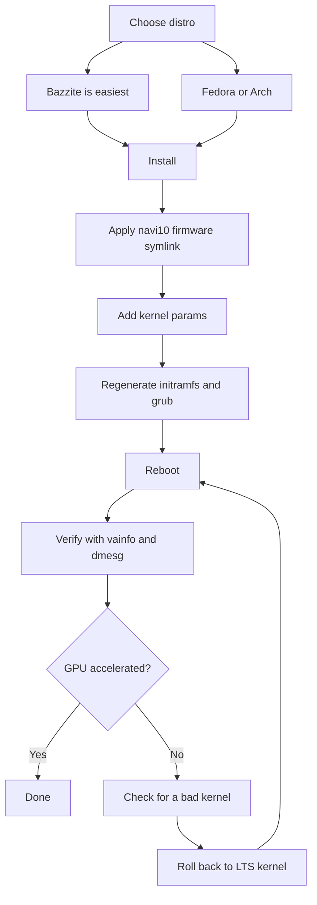

# Linux Drivers & Setup

> **TL;DR** — Most people run the BC-250 on Linux, and it works well *once the GPU is fixed*. Out of the box `amdgpu` doesn't recognize the chip and you get CPU-rendered, single-digit FPS. Two things make it real: a **modern kernel + fresh Mesa (25.1+)**, and the **`amdgpu` fix** — a firmware symlink so the driver can load (`navi10_gpu_info.bin` → `cyan_skillfish_gpu_info.bin`) plus kernel params (`amdgpu.sg_display=0`, `mitigations=off`, and on new kernels `amdgpu.bc250_cc_write_mode=3`). Easiest path for a newcomer: flash **[Bazzite](https://bazzite.gg/)** and rebase to the dedicated **`bazzite-bc250`** image — the fixes are baked in. Want to learn the machine: **Fedora** or **CachyOS/EndeavourOS (Arch)** with a one-time setup script.

This is the section that turns "a board in a box" into a working desktop. Do [cooling](04-cooling.md) and [power](03-power-supply.md) first — then this.

> **Never used Linux? A 60-second survival kit.**
> - **Open a terminal:** look for an app called *Terminal* / *Konsole* (KDE) / *Console* in your menu, or press `Ctrl-Alt-T`.
> - **`sudo`** in front of a command runs it as administrator. It will ask for your password — and **as you type, nothing shows on screen** (no dots, no stars). That's normal; type it and press Enter.
> - **`nano /etc/...`** opens a plain text editor in the terminal. To save and quit: **Ctrl-O**, then **Enter**, then **Ctrl-X**.
> - **Copy-paste** into a terminal is usually **Ctrl-Shift-V** (not Ctrl-V).
> - Many steps only take effect after a **reboot** (`systemctl reboot`). When a step says "reboot," actually reboot before judging whether it worked.

---

## The one thing you must understand

The BC-250's GPU is **Cyan Skillfish / Oberon** (a PlayStation 5-derived RDNA2 part). Mainline `amdgpu` historically had **no firmware blob named for it**, so on a stock install the kernel can't initialize the GPU and the desktop falls back to software (LLVMpipe) rendering — everything is slow and `vulkaninfo` shows no real device. One user spent days on "broken drivers" before realizing his distro had simply booted a kernel that couldn't load the GPU firmware ([src](https://t.me/c/2424231195/98466)).

So every working setup does the same three things, in some form:

1. **Run a kernel + Mesa new enough.** Upstream Mesa gained BC-250 support in **25.1** (no patches needed since then; **25.3.x** is the current recommended stable) — ([Mesa MR !33116](https://gitlab.freedesktop.org/mesa/mesa/-/merge_requests/33116), [src](https://t.me/c/2424231195/20891)). Temperature sensors landed in **kernel 6.15** ([src](https://t.me/c/2424231195/23542)); kernel **6.18.18 LTS** is the current sweet spot.
2. **Give `amdgpu` the firmware it wants** — on current setups an up-to-date **`linux-firmware`** already ships `cyan_skillfish_gpu_info.bin`; older systems still need the **navi10 symlink** (or a patched mesa/kernel package). See Path C.
3. **Pass the right kernel parameters** and regenerate initramfs + bootloader. (And install the **GPU governor** so clocks aren't pinned at 1500 MHz.)

Everything below is just *how* each distro does those three things.



---

## Which distro? (community poll favorites)

The chat repeatedly comes back to four. There's no single "right" answer — it's a trade between *zero effort* and *understanding your machine*. The elektricM docs test a wider field; here are all of them at a glance ([elektricM: distributions](https://elektricm.github.io/amd-bc250-docs/linux/distributions/)):

| Distro | Base | Effort | GPU fix | Best for |
|--------|------|--------|---------|----------|
| **Bazzite** (`bazzite-bc250` image) | Fedora atomic | **Lowest** — fixes baked in | Pre-applied in the image | Newcomers, "just play games" |
| **Fedora 43** (Workstation / KDE) | Fedora | Low | Mesa 25.x in mainline repos + governor COPR | Learn Linux, stay close to upstream |
| **CachyOS** | Arch | Medium | Mesa 25.1+ in repos + governor (AUR) | Max smoothness (BORE scheduler), HDR+VRR |
| **EndeavourOS / Arch** | Arch | Medium | Mesa 25.1+ in repos + governor | Arch without the install pain |
| **Debian (Testing/Sid) / PikaOS** | Debian | Medium–High | Mesa from `experimental` (Debian) / OOTB (PikaOS) | Stability, **lowest idle power (~50–60 W)** |
| **Manjaro** | Arch | Medium | Mesa 25.1+ in repos; boots OOTB after BIOS flash | Easy Arch; GNOME most stable |
| **Alpine** | Alpine (OpenRC) | High | manual mesa + firmware + governor | Minimal/headless, ~150 MB RAM / ~35 W |
| **Fedora CoreOS** | Fedora atomic | High | container host; post-install customizations | Headless container/LLM servers |
| **SteamOS** (Valve) | Arch (immutable) | Medium | Mesa from the **main-branch** image (not stable) + governor | A real Steam Machine feel; couch/Gaming Mode |
| **Batocera** | Linux (emulation distro) | Low–Medium | bundled Mesa + setup | A console-style **emulation** box ([15-emulation.md](15-emulation.md)) |

Notes from the chat and [elektricM](https://elektricm.github.io/amd-bc250-docs/linux/distributions/):
- **Bazzite is the easiest** and has a **dedicated BC-250 image** with the firmware fix, kernel params, GPU governor and the 40-CU/frequency patch already applied. Find it on artifacthub: [`bazzite-bc250`](https://artifacthub.io/packages/container/bazzite-bc250/bazzite_bc250). Several users moved to it precisely to stop hand-patching ([src](https://t.me/c/2424231195/121246)).
- **As of Fedora 43, Mesa 25.x is in the mainline repos** — the `mixaill/amd-bc-250` COPR is no longer needed just for Mesa. Fedora 42 is **end-of-life**; upgrade to 43. During install, if you get a black screen, use *Troubleshooting → Install in Basic Graphics Mode* ([elektricM: Fedora](https://elektricm.github.io/amd-bc250-docs/linux/fedora/)).
- **Don't blindly grab the "gamer" distros.** One detailed take argues that a plain **Fedora (Workstation/KDE)** or **vanilla Arch with LTS kernel + fresh Mesa** is the painless middle ground, and that heavy tuned forks can sometimes *break* Steam/FSR/vsync rather than help ([src](https://t.me/c/2424231195/102834)). Treat this as "as of late 2025" advice — the Bazzite image has matured since.
- **CachyOS over Bazzite, if you're chasing maximum smoothness.** A detailed r/BC250Gaming (Reddit) community report switched from Bazzite to **CachyOS** and found games noticeably smoother regardless of source, with fewer stutters/micro-freezes (e.g. *Mortal Kombat 1*), fewer random crashes and Steam-mode restarts, and a very responsive feel on the **default Btrfs** layout. It also got **HDR + VRR working properly** where Bazzite couldn't (HDR glitched, VRR never worked) — see [14-display.md](14-display.md). Treat it as one well-documented experience, not a universal verdict, but it's a strong option if Bazzite leaves you with stutter or instability. Setup is automated by the **[`redbeard1083/bc250-toolkit`](https://github.com/redbeard1083/bc250-toolkit)** script (BC-250 on CachyOS). ⚠ A separate community datapoint adds a thermal/FPS angle: at an *identical* overclock, CachyOS reportedly runs **~10 °C cooler than Bazzite** and gives higher FPS in CPU-bound titles (e.g. *Elden Ring* ~60–75 on CachyOS vs ~45–60 on Bazzite) ([+14], r/BC250Gaming — community-reported, varies; not independently confirmed).
- **Kernel version matters more than the distro.** Avoid known-bad kernels (see the warning box below). When in doubt, an **LTS kernel** (6.18.18 LTS recommended) is the safe choice — multiple users hit a wall on a too-new kernel and were rescued by switching to LTS ([src](https://t.me/c/2424231195/56529), [src](https://t.me/c/2424231195/59839)).
- **Desktop environment:** **GNOME has the best track record** on the BC-250. KDE Plasma had Qt RDRAND/RDSEED crashes — fixed in recent Qt (mid-2025) but GNOME is still the safe default; Cinnamon (X11) is a stable lightweight option ([elektricM: distributions](https://elektricm.github.io/amd-bc250-docs/linux/distributions/)).
- **Two more distros are community-confirmed booting** ([r/linux_gaming community thread](https://www.reddit.com/r/linux_gaming/comments/1nvsgji/)): **SteamOS** runs on the BC-250 — but use the **main-branch** SteamOS image, **not** the stable channel (stable ships an older Mesa without BC-250 support). And **Batocera**, the dedicated emulation distro, also boots and runs — a convenient way to turn the board into a console-style emulation box (see [15-emulation.md](15-emulation.md)). Both follow the same three rules as everything above (recent Mesa + the `amdgpu` firmware fix + kernel params/governor).

> One veteran summed up the experience after three months daily-driving the BC-250 on Linux: games launch from one click, RTX works, VR works, "abolutely seamlessly" — and he switched his main desktop to Linux because of it ([src](https://t.me/c/2424231195/61870)).

---

## Path A — Bazzite (recommended for newcomers)

Bazzite is an immutable Fedora-based gaming OS (SteamOS-like). The community maintains a **BC-250-specific image** so you don't touch firmware or kernel params yourself.

### A1. Install regular Bazzite first
1. Download from **[bazzite.gg](https://bazzite.gg/#image-picker)** (pick the desktop or "Deck"/Gaming-Mode variant).
2. Flash to USB (Ventoy, Rufus, or balenaEtcher) and install normally. **Create a non-root user** — Steam refuses to launch as root ([src](https://t.me/c/2424231195/121246)).

> **Picking the right Bazzite image (step-by-step).** On [bazzite.gg](https://bazzite.gg/) walk the picker **Desktop PC → AMD (modern) → KDE → Gaming-Mode image** — grab the **Gaming-Mode** build, not the plain live ISO: the live ISO installs fine but **can't actually run games**. Flash it with **Balena Etcher** onto a **≥16 GB** USB stick. The install **target** can be an M.2 NVMe, a SATA SSD on an M.2-to-SATA adapter, or even an **external USB** drive. A mid-November-2025 image shipped **Mesa 25.2.4** out of the box ([Old Lamer — Part IV](https://youtu.be/YuBmGF536II)).

> **Flash drive too small?** The Bazzite ISO is >9 GB. You can install plain **Fedora** (≈3 GB ISO, e.g. Kinoite/KDE) on a small stick, then *rebase* to Bazzite from the terminal ([src](https://t.me/c/2424231195/121246)):
> ```bash
> # KDE desktop:
> rpm-ostree rebase ostree-image-signed:docker://ghcr.io/ublue-os/bazzite:stable
> # or with Gaming Mode (SteamOS-like):
> rpm-ostree rebase ostree-image-signed:docker://ghcr.io/ublue-os/bazzite-deck:stable
> ```
> Reboot and you're in Bazzite.

### A2. Install the GPU governor (simplest current path)
As of early 2026 the **stock Bazzite kernel already includes the GPU frequency-range patch** — so you usually **don't need a custom image at all**. Just install the governor on top of regular Bazzite ([elektricM: Bazzite](https://elektricm.github.io/amd-bc250-docs/linux/bazzite/)):
```bash
sudo dnf copr enable filippor/bazzite
rpm-ostree install cyan-skillfish-governor-smu   # SMU variant — no kernel patch needed
systemctl reboot
sudo systemctl enable --now cyan-skillfish-governor-smu.service
# Pin the known-good deployment so an update can't silently break you:
rpm-ostree pin 0
```
The **`cyan-skillfish-governor-smu`** drives clocks through SMU firmware calls and supersedes the older `oberon-governor` (see *[Power governor](#b3-power-governor-cyan-skillfish-governor)*). A `cyan-skillfish-governor-tt` variant also exists but needs the kernel frequency patch (already in Bazzite). ⚠ The governor may target the wrong card (card0 vs card1) — verify if scaling doesn't kick in.

### A2-alt. (Optional) Rebase to the BC-250 image
Only if you want the extra pre-baked optimizations: switch to a maintained BC-250 image — the **`vietsman` "Bazzite on Steroids"** builds (firmware fix, kernel params, governor, extended 350–2230 MHz frequency patch baked in). Pick the desktop you installed — **GNOME is the recommended default** — and run:
```bash
# GNOME (recommended):
rpm-ostree rebase ostree-image-signed:docker://ghcr.io/vietsman/bazzite-gnome-patched:latest
# KDE:
rpm-ostree rebase ostree-image-signed:docker://ghcr.io/vietsman/bazzite-kde-patched:latest
# Deck / Gaming-Mode (SteamOS-like):
rpm-ostree rebase ostree-image-signed:docker://ghcr.io/vietsman/bazzite-deck-patched:latest
systemctl reboot
```
⚠ verify the current image/tag before running — image paths change. The up-to-date commands live on the [BC-250 docs Bazzite page](https://elektricm.github.io/amd-bc250-docs/linux/bazzite/) (also listed on artifacthub as [`bazzite-bc250`](https://artifacthub.io/packages/container/bazzite-bc250/bazzite_bc250)).

> ⚠ **Rebasing to a patched image can kill your USB WiFi (elektricM Issue #10).** The custom kernel may not include your USB WiFi/Bluetooth dongle's driver (the BC-250 has no built-in wireless). Have Ethernet ready, check `lsmod | grep <your_driver>` after rebase, `rpm-ostree install <driver-package>` if missing, or `rpm-ostree rollback && systemctl reboot`.

> **If the 40-CU unlock breaks fan control or your Xbox gamepad, swap in a custom kernel image.** Bazzite's built-in 40-CU unlock (the "Old-Lamer" method) is community-reported to break **fan control and Xbox controller support** on some setups ([+ r/BC250Gaming — community-reported, varies]). The **[`hafriedlander/kernel-bazzite`](https://github.com/hafriedlander/kernel-bazzite)** image is a custom kernel that fixes that — verified to be *"the (legacy) Bazzite kernel with the 40CU unlock patch for BC250 boards,"* built straight from Fedora's kernel-ark with the usual handheld/performance patch set (also packaged on the AUR as `linux-bazzite-bin`). ⚠ Whether it resolves your specific fan/gamepad regression is a community datapoint, not a guarantee — keep a known-good deployment pinned so you can `rpm-ostree rollback`.

After reboot, update going forward with the Bazzite helper:
```bash
ujust update          # update everything (or: rpm-ostree upgrade && flatpak update)
rpm-ostree rollback   # if an update breaks something, roll back and reboot
```

> **Two Bazzite gotchas worth knowing** ([elektricM: Bazzite](https://elektricm.github.io/amd-bc250-docs/linux/bazzite/)): constant **micro-stutter** in even light 2D games is usually the Handheld Daemon failing on a loop — disable it with `sudo systemctl mask --now hhd`. And **freezes when loading levels** after a BIOS flash usually mean the **CMOS wasn't cleared** — clear CMOS, reapply the VRAM setting.

> ⚠ **Bazzite's immutability blocks low-level network tools.** The read-only `/usr` means traffic-shaping / anti-throttling tools that install system services or kernel pieces (e.g. `zapret`-style tools) don't install cleanly. If you depend on one — common for some ISPs that throttle Steam — a mutable distro (Fedora/Arch) is the easier host (RU-specific details in the Russian edition).

### A3. Done — verify
Skip to **[Verifying GPU acceleration](#verifying-gpu-acceleration)** below. On the BC-250 image (or after A2) the firmware symlink, kernel params and governor are already in place.

---

## Path B — Fedora (Workstation / KDE)

Fedora is the most-documented non-atomic path and stays close to upstream. **On Fedora 43 the graphics stack needs no extra repo — Mesa 25.x is already in the mainline repos** ([elektricM: Fedora](https://elektricm.github.io/amd-bc250-docs/linux/fedora/)). The older `mixaill/amd-bc-250` COPR (below) is only needed on pre-43 releases.

### B1. Install Fedora
Download **Fedora 43 Workstation or KDE** ([fedoraproject.org](https://fedoraproject.org/workstation/download)) and install normally — **Fedora 42 is end-of-life**, upgrade to 43. If the installer shows a black screen, pick *Troubleshooting → Install Fedora in basic graphics mode* (this sets `nomodeset`; remove it after drivers are in). Reported-good baseline from the chat: kernel 6.14, GNOME 48, Mesa 25.0.2+ — "flies" ([src](https://t.me/c/2424231195/29150)). Fedora 41 with Cinnamon was called "stable as hell" running Cyberpunk, Witcher 3, etc. ([src](https://t.me/c/2424231195/12756)). On 43 prefer kernel **6.18.18 LTS** or **6.17.11+** and avoid the broken ranges (warning box below).

### B2. The setup script (does the work for you)
The canonical Fedora setup is automated by `mothenjoyer69/bc250-documentation`'s **`fedora-setup.sh`**. It enables the COPR, installs patched mesa, configures `amdgpu`, builds the governor and fixes the bootloader. The exact steps it runs (cross-checked against the script):

```bash
# 1. Patched mesa from COPR
sudo dnf copr enable mixaill/amd-bc-250 -y
sudo dnf upgrade --refresh -y

# 2. amdgpu module option + sensor module
echo 'options amdgpu sg_display=0'    | sudo tee /etc/modprobe.d/options-amdgpu.conf
echo 'nct6683'                        | sudo tee /etc/modules-load.d/99-sensors.conf
echo 'options nct6683 force=true'     | sudo tee /etc/modprobe.d/options-sensors.conf

# 3. Regenerate initramfs (Fedora uses dracut)
sudo dracut --regenerate-all --force

# 4. Bootloader: drop nomodeset, add kernel params
sudo sed -i 's/nomodeset//g' /etc/default/grub
sudo grub2-mkconfig -o /etc/grub2.cfg
sudo grubby --update-kernel=ALL --args="amdgpu.sg_display=0"
sudo grubby --update-kernel=ALL --args="mitigations=off"

# 5. OpenCL (optional, for compute/AI)
sudo dnf install mesa-libOpenCL --allowerasing
```
*(Source: `fedora-setup.sh` in [mothenjoyer69/bc250-documentation](https://github.com/mothenjoyer69/bc250-documentation), confirmed verbatim.)*

To just run the script instead of typing the steps, see the **"Simple setup script"** section of that repo's README (it points at [`fedora-setup.sh`](https://raw.githubusercontent.com/mothenjoyer69/bc250-documentation/refs/heads/main/fedora-setup.sh)). ⚠ Read a setup script before piping it to a shell.

### B3. Power governor (cyan-skillfish-governor)
The board runs a flat 1500 MHz / 1000 mV out of the box; a **governor** scales clocks (idle ↔ ~2000 MHz) and lets you undervolt. The current recommended one is **`cyan-skillfish-governor-smu`**, from the `filippor/bazzite` COPR ([elektricM: Fedora](https://elektricm.github.io/amd-bc250-docs/linux/fedora/), confirmed Mar 2026):
```bash
sudo dnf copr enable filippor/bazzite
sudo dnf install cyan-skillfish-governor-smu
sudo systemctl enable --now cyan-skillfish-governor-smu
systemctl status cyan-skillfish-governor-smu        # check it's running
```
Config lives in `/etc/cyan-skillfish-governor-smu/config.toml`. Full tuning is covered in **[09-overclock-undervolt.md](09-overclock-undervolt.md)**.

> **SMU vs the older oberon-governor.** `cyan-skillfish-governor-smu` drives clocks through SMU firmware calls and **needs no kernel frequency patch on any distro** — it has effectively replaced the older `oberon-governor` everywhere in the elektricM docs ([elektricM: kernel](https://elektricm.github.io/amd-bc250-docs/linux/kernel/)). The same COPR also ships a `cyan-skillfish-governor-tt` variant, which *does* need the kernel patch. If you already run `oberon-governor`, stop/disable/remove it (`sudo systemctl disable --now oberon-governor`, remove `/etc/oberon-config.yaml`) before installing the SMU one.

### B4. Reboot and verify
Reboot, then jump to **[Verifying GPU acceleration](#verifying-gpu-acceleration)**.

---

## Path C — Arch family (CachyOS / EndeavourOS)

Arch-based installs historically needed the **firmware symlink done by hand** plus a fresh Mesa. This is the most "manual" path but the same three ideas apply.

> **Heads-up — the symlink may already be obsolete for you.** The elektricM per-distro guides for [Arch](https://elektricm.github.io/amd-bc250-docs/linux/arch/), [CachyOS](https://elektricm.github.io/amd-bc250-docs/linux/cachyos/) and others **no longer create the navi10 symlink** at all — on a current kernel with an up-to-date `linux-firmware` (Arch) / `linux-firmware-amdgpu` (Alpine) package the `cyan_skillfish_gpu_info.bin` blob now ships, and Mesa 25.1+ does the rest. Try **without** the symlink first; only fall back to C1 if `dmesg` shows `amdgpu: Failed to get gpu_info firmware` (i.e. your firmware package is too old to include it).

### C1. The amdgpu firmware fix (the critical symlink) — only if firmware is missing
`amdgpu` looks for `cyan_skillfish_gpu_info.bin`; the **navi10** blob works in its place. This was the single most-repeated command in the chat (5×) ([src](https://t.me/c/2424231195/45453)) and is still the fix if your distro's `linux-firmware` predates the blob:

```bash
sudo ln -s /lib/firmware/amdgpu/navi10_gpu_info.bin.zst \
           /lib/firmware/amdgpu/cyan_skillfish_gpu_info.bin.zst
```

> ⚠ **verify the path on your system.** On distros that ship **uncompressed** firmware, drop the `.zst` on both names:
> ```bash
> sudo ln -s /lib/firmware/amdgpu/navi10_gpu_info.bin \
>            /lib/firmware/amdgpu/cyan_skillfish_gpu_info.bin
> ```
> **Which is yours?** Run `ls /lib/firmware/amdgpu/ | grep -i navi10` and look at the source file's name: if it ends in `.zst` use the first (`.zst`) command, otherwise use the second — the link name must match the file that actually exists. After creating the link you **must** regenerate initramfs (next step) so the firmware is picked up at boot.

### C2. Fresh Mesa
On EndeavourOS/CachyOS the community route is **chaotic-aur** + `mesa-tkg-git`. Condensed from a pinned EndeavourOS mini-guide ([src](https://t.me/c/2424231195/50399)) and a SteamOS guide ([src](https://t.me/c/2424231195/52411)):

```bash
# Add the chaotic-aur key + mirrorlist (see https://aur.chaotic.cx/docs for the current keys)
sudo pacman-key --recv-key 3056513887B78AEB --keyserver keyserver.ubuntu.com
sudo pacman-key --lsign-key 3056513887B78AEB
sudo pacman -U 'https://cdn-mirror.chaotic.cx/chaotic-aur/chaotic-keyring.pkg.tar.zst'
sudo pacman -U 'https://cdn-mirror.chaotic.cx/chaotic-aur/chaotic-mirrorlist.pkg.tar.zst'

# Append to /etc/pacman.conf:
#   [chaotic-aur]
#   Include = /etc/pacman.d/chaotic-mirrorlist
sudo nano /etc/pacman.conf

sudo pacman -Syu
sudo pacman -Sy mesa-tkg-git lib32-mesa-tkg-git   # (or: yay -S mesa-tkg-git lib32-mesa-tkg-git)
sudo pacman -S vulkan-tools                        # for vulkaninfo
```
There are also prebuilt AUR packages: [`amdonly-gaming-mesa-git`](https://aur.archlinux.org/packages/amdonly-gaming-mesa-git) and [`mesa-amd-bc250`](https://aur.archlinux.org/packages/mesa-amd-bc250). ⚠ The chaotic-aur signing key can rotate — always copy the current keys from [aur.chaotic.cx/docs](https://aur.chaotic.cx/docs).

> **Simplest path on current Arch/CachyOS:** Mesa **25.1+ is in the official `extra` repos** now — `sudo pacman -S mesa vulkan-radeon lib32-vulkan-radeon` is enough, no chaotic-aur or `mesa-tkg-git` required. The `-tkg`/AUR builds only matter on older distros ([elektricM: Arch](https://elektricm.github.io/amd-bc250-docs/linux/arch/), [src](https://t.me/c/2424231195/20891)). Mesa **26** (git) is already confirmed working on Debian sid / Ubuntu 26.04 daily.
>
> To skip the manual steps entirely, the elektricM Arch guide points at the **`eabarriosTGC/BC250--ARCH`** setup script (`Arch-setup.sh`, or `bc520-manjaro.sh` for Manjaro), which installs the governor, sets up sensors, writes `/etc/environment.d/99-radv-bc250.conf` with `RADV_DEBUG=nohiz`, and regenerates initramfs ([elektricM: Arch](https://elektricm.github.io/amd-bc250-docs/linux/arch/)). On **CachyOS** specifically, the r/BC250Gaming (Reddit) community report uses **[`redbeard1083/bc250-toolkit`](https://github.com/redbeard1083/bc250-toolkit)**, a setup script tailored to BC-250 on CachyOS. ⚠ Read any setup script before running it.

### C3. Kernel parameters + regenerate
Add the BC-250 kernel parameters, then rebuild initramfs and grub. Edit `/etc/default/grub` and put these in `GRUB_CMDLINE_LINUX_DEFAULT` (canonical set per the [elektricm BC-250 docs](https://elektricm.github.io/amd-bc250-docs/linux/kernel/)):

```
amdgpu.sg_display=0 mitigations=off amdgpu.bc250_cc_write_mode=3 ttm.pages_limit=3959290 ttm.page_pool_size=3959290
```

Then regenerate (Arch uses **mkinitcpio**, then grub):
```bash
sudo mkinitcpio -P
sudo grub-mkconfig -o /boot/grub/grub.cfg
```
On distros that use `update-grub` (Debian/Ubuntu/SteamOS), that wrapper replaces the `grub-mkconfig` line ([src](https://t.me/c/2424231195/52411)).

### C4. Governor + reboot
Install **`cyan-skillfish-governor-smu`** from the AUR (the modern replacement for `oberon-governor` — no kernel patch needed), enable the service, reboot, and verify ([elektricM: CachyOS](https://elektricm.github.io/amd-bc250-docs/linux/cachyos/)):
```bash
yay -S cyan-skillfish-governor-smu
sudo systemctl enable --now cyan-skillfish-governor-smu.service
cat /sys/class/drm/card0/device/pp_dpm_sclk   # the * should move between clocks under load
```
A `cyan-skillfish-governor-tt` variant exists for those who prefer the kernel-patch route. The older `oberon-governor` ([gitlab.com/mothenjoyer69/oberon-governor](https://gitlab.com/mothenjoyer69/oberon-governor), `cmake . && make && sudo make install`) still works but is being phased out.

> ⚠ **Known Arch/Manjaro/CachyOS quirk:** the governor often **doesn't start scaling on boot** — the GPU sits at 1500 MHz until you launch any game/benchmark once, after which it behaves. Fedora/Bazzite aren't affected. Workaround: `sudo systemctl restart cyan-skillfish-governor-smu` after boot ([elektricM: Arch](https://elektricm.github.io/amd-bc250-docs/linux/arch/)).

---

## Niche-distro deltas (Alpine / CoreOS / Debian / CachyOS)

The four paths above cover most people. The distros below need the *same three things*, but with distro-specific package names and mechanisms — these are the BC-250 deltas, not full install guides.

### CachyOS — pick the right microarch level
CachyOS asks you to choose an x86-64 **microarchitecture level** at install. **Pick `x86-64-v3`** — it's the best-compatibility choice for **Zen 2** ([elektricM: CachyOS](https://elektricm.github.io/amd-bc250-docs/linux/cachyos/)). ⚠ Do **not** pick `x86-64-v4`: that level requires AVX-512, which the BC-250's Zen 2 cores lack, so a v4 install won't run. Use the LTS kernel — `sudo pacman -S linux-cachyos-lts linux-cachyos-lts-headers`. To migrate an **existing Arch** box onto CachyOS repos instead of reinstalling:
```bash
wget https://mirror.cachyos.org/cachyos-repo.tar.xz
tar xvf cachyos-repo.tar.xz
cd cachyos-repo
sudo ./cachyos-repo.sh   # choose x86-64-v3 when prompted
```
Everything else (firmware, Mesa 25.1+, governor, kernel params) follows **Path C** above.

### Debian — pin Mesa to `experimental`
Stable/Testing Mesa is too old; you want Mesa **only** from `experimental` without dragging the rest of the system there ([elektricM: Debian](https://elektricm.github.io/amd-bc250-docs/linux/debian/)). Add the repo:
```
deb http://deb.debian.org/debian experimental main contrib non-free non-free-firmware
```
Then **APT-pin** so only the Mesa packages track experimental — `/etc/apt/preferences.d/experimental`:
```
Package: mesa-vulkan-drivers libgl1-mesa-dri
Pin: release a=experimental
Pin-Priority: 500
```
Install Mesa and a newer kernel:
```bash
sudo apt install -t experimental mesa-vulkan-drivers libgl1-mesa-dri
sudo apt install linux-xanmod-lts-x64v3       # Xanmod LTS, v3 build
```
The governor has **no COPR/AUR on Debian** — install it from the upstream release tarball:
```bash
tar -xf cyan-skillfish-governor-smu-*-x86_64-linux.tar.gz
cd cyan-skillfish-governor-smu-*/
sudo ./scripts/install.sh
sudo systemctl enable --now cyan-skillfish-governor-smu.service
```

### Alpine — the only systemd-free governor recipe
Alpine uses **OpenRC**, not systemd, so the governor needs hand-wiring ([elektricM: Alpine](https://elektricm.github.io/amd-bc250-docs/linux/alpine/)). The firmware package is **`linux-firmware-amdgpu`** (it ships `cyan_skillfish_gpu_info.bin`) — the generic `linux-firmware` name used elsewhere in this doc **does not apply on Alpine**. Install the stack (no `sudo` by default — use **`doas`**, or `apk add sudo`):
```sh
doas apk add linux-lts linux-firmware-amdgpu \
  mesa-vulkan-ati vulkan-loader vulkan-tools mesa-dri-gallium
```
Kernel params go in **`/etc/update-extlinux.conf`** (Alpine uses extlinux, **not** grub/dracut); after editing, rebuild:
```sh
doas mkinitfs
doas update-extlinux
```
The governor is built from the **`smu`** branch with `cargo build --release`, and because it talks over D-Bus it needs **both** a D-Bus policy file and an OpenRC service:
- **D-Bus policy** `/etc/dbus-1/system.d/com.cyan.skillfishgovernor.conf` (lets it own the bus name `com.cyan.SkillFishGovernor`);
- **OpenRC service** `/etc/init.d/cyan-skillfish-governor-smu`, which declares `need dbus`.

Enable D-Bus and reboot:
```sh
doas rc-update add dbus default
doas rc-service dbus start
```

### Fedora CoreOS — immutable-host 40-CU unlock & ACPI fix
On the immutable CoreOS host you can't just pass `amdgpu.bc250_cc_write_mode=3` the easy way, so the 40-CU unlock is done as a **boot service via `umr`** that writes the GPU registers once per boot ([elektricM: CoreOS](https://elektricm.github.io/amd-bc250-docs/linux/fedora-coreos/)):
```bash
rpm-ostree install umr
# then a oneshot /etc/systemd/system/gpu-unlock.service that runs the umr
# register writes (mmRLC_PG_ALWAYS_ON_WGP_MASK / mmCC_GC_SHADER_ARRAY_CONFIG /
# mmSPI_PG_ENABLE_STATIC_WGP_MASK on *.gfx1013) after a short boot delay,
# then: systemctl enable gpu-unlock.service
```
The **ACPI cpufreq fix** (the `bc250-acpi-fix` SSDT tables) is applied the rpm-ostree way — drop the `.aml` files in `/etc/dracut.conf.d/acpi/`, add `/etc/dracut.conf.d/99-acpi-override.conf`:
```
acpi_override="yes"
acpi_table_dir="/etc/dracut.conf.d/acpi"
```
then bake them into the initramfs with `rpm-ostree initramfs --enable` and reboot. (See *Known-bad kernels & gotchas* below for the non-atomic dracut route.)

---

## What each kernel parameter does

Cross-checked against the [elektricm BC-250 docs](https://elektricm.github.io/amd-bc250-docs/linux/kernel/) and the AMD-BC-250 / mothenjoyer69 setup scripts:

| Parameter | What it does |
|-----------|--------------|
| `amdgpu.sg_display=0` | Disables scatter-gather display. Needed on **kernels < 6.10** to avoid a black screen; harmless to keep. The single most-cited boot fix in the chat ([src](https://t.me/c/2424231195/52411)). |
| `mitigations=off` | Turns off CPU vulnerability mitigations. elektricM measures **+18 FPS in Cyberpunk 2077** (60 → 78 at 1080p high), ~5–10% CPU gain overall — at the cost of security. Optional; gaming-only systems. |
| `amdgpu.bc250_cc_write_mode=3` | Opt-in **40-CU unlock** for new kernels: writes two HW registers to re-enable all 40 compute units (default off). Guarded by PCI ID `0x13FE`, no permanent HW change. Power jumps hard (e.g. 56 W → 181 W in llama-bench) — compute-only worth it. See [09-overclock-undervolt.md](09-overclock-undervolt.md). |
| `amdgpu.gttsize=14750` **+** `ttm.pages_limit=3959290` `ttm.page_pool_size=3959290` | Let the GPU map more system RAM (≈14.5–14.75 GB). elektricM uses **all three together**, not as alternatives — `gttsize` sets the GTT size and the two `ttm` values raise the page limits. Pairs with a 512 MB-dynamic BIOS VRAM split ([elektricM: kernel](https://elektricm.github.io/amd-bc250-docs/linux/kernel/)). |

> ⚠ **Do NOT pass `amd_iommu=on`** to make the memory params work — they work *without* IOMMU, which must stay off (next section). The values above can also go in `/etc/modprobe.d/` instead of the kernel cmdline: `options ttm pages_limit=3959290 page_pool_size=3959290` / `options amdgpu gttsize=14750`, then rebuild initramfs.

> **A note on VRAM/buffer size:** the APU performs best with the **smallest** GPU framebuffer carve-out (e.g. 512 MB) so it can share the 16 GB pool dynamically — but changing that needs a **modified BIOS**, covered in [08-bios.md](08-bios.md) ([src](https://t.me/c/2424231195/38599)).

> 📋 **One veteran's canonical daily-driver config (quick reference):** **CPU 4 GHz / GPU 2 GHz 40 CU / VRAM BIOS 512 MB / `mitigations=off` / zswap + 32 GB swap.** That's the whole tuned setup in one line — GPU clock + the 40-CU unlock + a tiny 512 MB BIOS split + mitigations off + the zswap swap fix below ([Old Lamer](https://youtu.be/bXlKcFPeSoU)). Each piece is detailed in [09-overclock-undervolt.md](09-overclock-undervolt.md) and the boxes around here.

> 💥 **Games crashing for lack of RAM (RDR2, Company of Heroes 3)? Use zswap + a big Btrfs swapfile.** With only 16 GB shared between CPU and GPU, memory-hungry titles run out and crash — and systemd's **ZRAM** swap makes it worse on the 512 MB dynamic split (it confuses the allocator into OOM-ing with RAM still free). The fix that holds: **disable systemd ZRAM, enable zswap, and add a 32 GB Btrfs swapfile** (on Btrfs use `btrfs filesystem mkswapfile`). It doesn't add real memory, but it stops the RAM-shortage crashes ([Old Lamer — Part XIV](https://youtu.be/A6juAoY70aU)). Full step-by-step (zswap `lz4`, swapfile, `vm.swappiness=180`, the Bazzite/`rpm-ostree` variant) is in [09-overclock-undervolt.md](09-overclock-undervolt.md).

---

## ⚠ Disable IOMMU in BIOS (do this once)

**IOMMU is broken on the BC-250 and must be disabled.** Left enabled, it causes **display failures, black screens, and random crashes**, and GPU passthrough to a VM isn't possible either way. This is a BIOS setting, not a distro choice — do it on the first boot regardless of which path above you took. Find the **IOMMU** option in BIOS setup (usually under *Advanced → AMD CBS / NBIO* or *North Bridge*) and set it to **Disabled**, then save and reboot ([elektricM hardware docs](https://elektricm.github.io/amd-bc250-docs/), reverse-engineering by mothenjoyer69 / Segfault / neggles / yeyus).

> ⚠ verify — the elektricM source documents the **BIOS** disable only. Some kernels also accept `iommu=off` / `amd_iommu=off` as a kernel parameter, but that has **not** been confirmed on the BC-250; treat it as unverified and prefer the BIOS setting.

---

## Verifying GPU acceleration

After the first reboot, confirm the GPU is actually being used (not software rendering).

**1. Is the device visible to Vulkan?** You should see the BC-250 / AMD device, not just LLVMpipe:
```bash
vulkaninfo | grep deviceName
```
A correct setup shows **two devices** (the iGPU surfaces twice on this board) ([src](https://t.me/c/2424231195/50399)).

**2. Vulkan driver is RADV** (not AMDVLK or llvmpipe):
```bash
vulkaninfo | grep driverName     # expect: driverName = radv
```
The device name should read **`AMD Radeon Graphics (RADV GFX1013)`**.

> ⚠ **Don't expect `vainfo` to work — hardware video decode/encode is dead on the BC-250.** The VCN block's firmware is **blocked by Sony**, so `vainfo` fails (`vaInitialize failed ... -1`) and there's no GPU H.264/H.265 accel. This is not a bug in your setup — use **software decode** (mpv/VLC fall back automatically) and **x264** for OBS. Unlikely to ever change ([elektricM: RADV](https://elektricm.github.io/amd-bc250-docs/drivers/radv/)).

**3. OpenGL renderer string** (should name AMD/`gfx1013`, not `llvmpipe`):
```bash
glxinfo | grep -i "OpenGL renderer"
# e.g. AMD Radeon Graphics (radv gfx1013 ...) — llvmpipe here means the GPU is NOT working
```

**4. Compute units active** — confirm `amdgpu` initialized the GPU and how many CUs are live:
```bash
sudo dmesg | grep -i active_cu_number
```
This is the quickest check that the firmware loaded and (if you set `bc250_cc_write_mode=3`) that all 40 CUs came up. ⚠ verify — exact `dmesg` field name can vary by kernel; if it's empty, also try `dmesg | grep -i amdgpu` and look for successful firmware loads rather than `cyan_skillfish_gpu_info` *failed to load* errors.

> **`dmesg`/CU-check shows nothing as a normal user?** Many distros restrict kernel-log access, so the CU readout and helper scripts like **`cu_map.sh`** print empty. Lift the restriction for the session so the checks display correctly ([4pda — das504](https://4pda.to/forum/index.php?showtopic=1104980)):
> ```bash
> sudo sysctl kernel.dmesg_restrict=0
> ```

**5. Sanity-check temps/clocks** ([src](https://t.me/c/2424231195/23542); elektricM notes the module needs kernel **6.11+**):
```bash
sudo modprobe nct6683 force=true   # force=true is ALWAYS required — the chip isn't auto-detected
sensors                            # reports as nct6686-isa-0a20
```
A healthy idle reads ~1500 MHz SCLK / ~47 °C; under Furmark ~1900 MHz / ~78 °C ([src](https://t.me/c/2424231195/89232)). For PWM **fan control** (not just monitoring) you need the out-of-tree `nct6687` driver instead — see **[Sensors & fan control](#sensors--fan-control)** below.

If `vulkaninfo` only shows `llvmpipe` and `dmesg` shows amdgpu firmware load errors, you almost certainly **booted a bad kernel** or the **firmware symlink/initramfs** step didn't take — see below.

---

## RADV environment variables (fixing glitches & games)

The BC-250's Vulkan driver is **RADV** (it's the *only* working driver — AMDVLK and AMDGPU-PRO don't support GFX1013). A few environment variables fix the artifacts people hit most. Full list on [elektricM: environment](https://elektricm.github.io/amd-bc250-docs/drivers/environment/) and [elektricM: RADV](https://elektricm.github.io/amd-bc250-docs/drivers/radv/).

> ⚠ **`RADV_DEBUG` is an environment variable, NOT a kernel parameter.** Never put it in `/etc/default/grub`. Set it per-game in Steam, in your shell, or system-wide in `/etc/environment`.

| Variable | What it fixes | Where |
|----------|---------------|-------|
| `RADV_DEBUG=nohiz` | Visual artifacts / black squares — disables hierarchical-Z. The **recommended default** on Mesa 25.1+. | Steam: `RADV_DEBUG=nohiz %command%` |
| `RADV_DEBUG=nocompute` | The broken compute-only queue. **Deprecated on Mesa 25.1+** — it's disabled automatically now; only needed on Mesa ≤ 25.0. | `/etc/environment` |
| `RADV_DEBUG=aco AMD_DEBUG=aco` | Persistent **black squares on custom/patched kernels** when `nohiz` alone doesn't help — forces the ACO shader backend. | per-game |
| `AMD_VULKAN_ICD=RADV` | Forces RADV if AMDVLK ever loads instead. | `/etc/environment` |
| `MESA_LOADER_DRIVER_OVERRIDE=zink` | Routes **OpenGL over Vulkan** (Zink) — can help some GL titles. | per-game |
| `VK_ICD_FILENAMES=…/radeon_icd.x86_64.json` | Steam Big Picture / apps that can't find the Vulkan driver. | per-game/session |

A good default Steam launch line: `RADV_DEBUG=nohiz mangohud %command%`. For **memory errors** in games, add `radv_enable_unified_heap_on_apu` to `/etc/drirc`:
```xml
<driconf><device><application name="Default">
  <option name="radv_enable_unified_heap_on_apu" value="true" />
</application></device></driconf>
```

> **Compute / LLM note:** ROCm on GFX1013 is barely functional (rocBLAS ships no `gfx1013` kernels) — use the **Vulkan** backend instead. `llama.cpp` Vulkan runs a 4-bit 8B model at ~60 tok/s; set `GGML_VK_FORCE_MAX_ALLOCATION_SIZE=2000000000` to avoid OOM. Vulkan sees only ~10 GB of a 12 GB split. To expose containers' GPU under Podman: `--device /dev/dri --device /dev/kfd` ([elektricM: RADV](https://elektricm.github.io/amd-bc250-docs/drivers/radv/), [elektricM: CoreOS](https://elektricm.github.io/amd-bc250-docs/linux/fedora-coreos/)).

> ⚠ **After a Mesa upgrade, a stale shader cache can cause new crashes/artifacts.** Bisect it by launching with `MESA_SHADER_CACHE_DISABLE=1` — if the problem disappears, clear the cache and let it rebuild ([elektricM: RADV](https://elektricm.github.io/amd-bc250-docs/drivers/radv/)):
> ```bash
> rm -rf ~/.cache/mesa_shader_cache
> rm -rf ~/.local/share/Steam/steamapps/shadercache   # Steam keeps its own
> ```

> **The definitive "is the GPU actually loaded?" check** is the debugfs `amdgpu_pm_info` — it prints live SCLK/MCLK and power draw, so a moving clock under load proves the GPU (not LLVMpipe) is doing the work; it complements `pp_dpm_sclk` from the governor checks above:
> ```bash
> sudo cat /sys/kernel/debug/dri/0/amdgpu_pm_info
> ```
> ⚠ verify — the path is the standard amdgpu **debugfs** node (the DRI index may be `0` or `1`; try both). The elektricM RADV page itself documents `pp_dpm_sclk` + `nvtop` for this; treat `amdgpu_pm_info` as the kernel-level complement.

---

## Sensors & fan control

The BC-250's Super-I/O chip is a **Nuvoton NCT6686D**. Two drivers exist — pick by what you need ([elektricM: sensors](https://elektricm.github.io/amd-bc250-docs/system/sensors/)):

- **`nct6683`** (in-kernel) — **read-only** monitoring (temps, voltages, fan RPM). No fan control.
- **`nct6687`** (out-of-tree, [Fred78290/nct6687d](https://github.com/Fred78290/nct6687d)) — **read + write, including PWM fan control.** Needed for CoolerControl/manual curves.

Both need **`force=true`** (the chip isn't auto-detected) and both report as `nct6686-isa-0a20`. **Don't load both** — they conflict.

> **Install `lm-sensors` first — the package name is split.** It's **`lm_sensors`** (underscore) on **Fedora/Bazzite** (`sudo dnf install lm_sensors`) and **Arch** (`sudo pacman -S lm_sensors`), but **`lm-sensors`** (hyphen) on **Debian/Ubuntu** (`sudo apt install lm-sensors`). Then run `sudo sensors-detect` (answer **YES** to all prompts) ([elektricM: sensors](https://elektricm.github.io/amd-bc250-docs/system/sensors/)).

> **The two drivers also label the fields differently** ([elektricM: sensors](https://elektricm.github.io/amd-bc250-docs/system/sensors/)). `nct6683` (read-only) shows **generic** labels — `VIN0`–`VIN16`, `fan1`–`fan5`, and temps like `AMD TSI Addr 98h` / `Thermistor 14/15`. `nct6687` (writable PWM) shows **friendly** labels — `+12V`, `+5V`, `+3.3V`, `CPU Soc`, `CPU Vcore`, `VRM MOS`, `CPU Fan`, `Pump Fan`, `System Fan #1`–`#6`. Alongside the Nuvoton chip, the CPU temperature itself comes from **`k10temp`** (adapter `k10temp-pci-00c3`, field `Tctl`) — that's the Zen 2 die sensor, separate from `nct6686`.

**Read-only (nct6683):**
```bash
echo 'options nct6683 force=true' | sudo tee /etc/modprobe.d/sensors.conf
echo 'nct6683'                    | sudo tee /etc/modules-load.d/99-sensors.conf
# then regenerate initramfs: dracut --force (Fedora) / mkinitcpio -P (Arch) / update-initramfs -u (Debian), reboot
```

**PWM fan control (nct6687 — build from source, blacklist nct6683):**
```bash
git clone https://github.com/Fred78290/nct6687d.git && cd nct6687d && make && sudo make install
echo 'blacklist nct6683'          | sudo tee    /etc/modprobe.d/sensors.conf
echo 'options nct6687 force=true' | sudo tee -a /etc/modprobe.d/sensors.conf
echo 'nct6687'                    | sudo tee    /etc/modules-load.d/99-sensors.conf
# regenerate initramfs + reboot (as above)
```

> ⚠ **PWM values don't persist across reboot** with `nct6687` — use **CoolerControl** (`ujust install-coolercontrol` on Bazzite; `dnf install coolercontrol` from the Terra COPR on Fedora; `yay -S coolercontrol` on Arch) or a systemd/udev rule to set them at boot.

The board has two fan headers (**J1** primary, **J4003** secondary); the main fan usually shows up as **Pump Fan** / `fan2`. Useful direct reads — the raw sysfs files come in milli-/micro- units, so pipe through `awk` to get human values ([elektricM: sensors](https://elektricm.github.io/amd-bc250-docs/system/sensors/)):
```bash
# GPU temp: temp1_input is milli-°C → °C
cat /sys/class/drm/card0/device/hwmon/hwmon*/temp1_input    | awk '{print $1/1000 "°C"}'
# GPU power: power1_average is µW → W
cat /sys/class/drm/card0/device/hwmon/hwmon*/power1_average | awk '{print $1/1000000 "W"}'
```
Terminal monitors: `nvtop`, `radeontop`, `MangoHud` in-game. The BIOS also has **Default / Full Speed / Customize** fan modes — use **Full Speed** while validating cooling ([elektricM: sensors](https://elektricm.github.io/amd-bc250-docs/system/sensors/)).

### In-game overlay — a ready MangoHud config
`MangoHud` shows GPU/CPU temps, power, VRAM/RAM and frame timing right on top of the game (Steam launch line `mangohud %command%`, or `mangohud <app>`). Drop this in `~/.config/MangoHud/MangoHud.conf` for a BC-250-appropriate readout ([elektricM: sensors](https://elektricm.github.io/amd-bc250-docs/system/sensors/)):
```ini
gpu_temp
cpu_temp
gpu_power
cpu_power
vram
ram
fps_limit=60
frame_timing=1
position=top-left
font_size=24
```
`gpu_power`/`cpu_power` read the same hwmon sensors as above; `fps_limit=60` caps the frame rate (the BC-250 is happiest fed a fixed target rather than racing), and `frame_timing=1` draws the frametime graph that exposes stutter.

> **Don't want to hand-edit the config?** Install **`goverlay`** (`dnf install goverlay` on Fedora, also packaged for Arch/Bazzite) — a GUI front-end that writes `MangoHud.conf` for you. For a plain always-on **desktop** monitor outside games, **GKrellM** is a lightweight temp/clock widget ([4pda](https://4pda.to/forum/index.php?showtopic=1104980)).

---

## ⚠ Known-bad kernels & gotchas

The driver story changed a lot across the chat's 17 months. The elektricM kernel matrix is the authoritative version-by-version list ([elektricM: kernel](https://elektricm.github.io/amd-bc250-docs/linux/kernel/)) — distilled (as of March 2026):

| Kernel | Status | Note |
|--------|--------|------|
| 6.12 / 6.14 LTS | ✅ Good | Reliable stable fallback |
| **6.15.0 – 6.15.6** | ❌ **Broken** | GPU init fails, kernel panics |
| 6.15.7 – 6.17.7 | ✅ Good | Full support |
| **6.17.8 – 6.17.10** | ❌ **Broken** | GPU driver broken — **fixed in 6.17.11** |
| 6.17.11+ | ✅ Good | Fix applied (Fedora, Dec 2025+) |
| **6.18.18 LTS** | ✅ **Best / recommended** | Current LTS, ~5–10% faster than 6.17 |
| 6.19.x | ✅ Good | Current stable (6.19.8 confirmed) |
| 7.0-rc | 🔬 Mainline | Untested on BC-250, not for daily use |

- **Two broken windows, not one.** Earlier chat flagged `6.14.7` ([Fedora warning thread](https://www.reddit.com/r/Fedora/comments/1kqyhyf/warning_for_amdgpu_users_dont_update_to_6147_or/)); the durable ranges to avoid are **6.15.0–6.15.6** and **6.17.8–6.17.10**. A user's Fedora silently booted a bad 6.17, amdgpu couldn't load firmware (`amdgpu: Failed to get gpu_info firmware` / `Fatal error during GPU init`), everything fell to CPU. Fix: boot a working kernel, then **remove and version-lock** the bad one ([src](https://t.me/c/2424231195/98466)) — `dnf versionlock add kernel` (Fedora), `IgnorePkg = linux` in `/etc/pacman.conf` (Arch), `apt-mark hold` (Debian).
  - **Arch — concrete downgrade recipe.** To drop back to a known-good kernel and then hold it ([4pda — InfernalWolf666](https://4pda.to/forum/index.php?showtopic=1104980)):
    ```bash
    yay -S downgrade
    sudo downgrade linux          # in the list, pick e.g. 6.17.7 arch 1-2
    sudo grub-mkconfig -o /boot/grub/grub.cfg
    # then skip it on future upgrades:
    sudo pacman -Syu --ignore linux,linux-headers,linux-zen
    ```
- **When stuck, use LTS.** Several newcomers hit a wall building dev libs / drivers on a bleeding-edge kernel and were unblocked by switching to an **LTS kernel** ([src](https://t.me/c/2424231195/56529)).
- **On Arch, snapshot before every update.** Because a kernel/Mesa bump can break the GPU, put the root on **Btrfs** and take a **snapper** or **timeshift** snapshot before `pacman -Syu` — then a bad update is a one-command rollback instead of a reinstall ([4pda](https://4pda.to/forum/index.php?showtopic=1104980)). (Atomic distros like Bazzite get this for free via `rpm-ostree rollback`.)
- **Unpatched kernels cap GPU clocks at 1000–2000 MHz.** The extended **350–2230 MHz** range needs either the kernel frequency patch (pre-applied in Bazzite/PikaOS) **or** the SMU governor, which unlocks it without patching ([elektricM: kernel](https://elektricm.github.io/amd-bc250-docs/linux/kernel/)).
- **HDMI audio on kernel 6.17+** needed a workaround (rebuild with `CONFIG_SND_HDA_CODEC_HDMI_ATI=m` / `snd-hda-codec-atihdmi.ko`) — DisplayPort is the safer output ([src](https://t.me/c/2424231195/68051)). DisplayPort audio on the BC-250 can also come out **pitched-down/slowed** — a passive DP→HDMI or USB audio adapter is the fix ([elektricM: Arch](https://elektricm.github.io/amd-bc250-docs/linux/arch/)).
- **CPU frequency scaling needs the ACPI fix.** Out of the box the BC-250 has **no working `cpufreq`** — the CPU is stuck. Installing the [`bc250-acpi-fix`](https://github.com/bc250-collective/bc250-acpi-fix) SSDT-PST/CST tables (drop the `.aml` files via dracut/initramfs) enables 8 P-states (800–3200 MHz); then `schedutil` is the recommended governor ([elektricM: Fedora](https://elektricm.github.io/amd-bc250-docs/linux/fedora/), [elektricM: CoreOS](https://elektricm.github.io/amd-bc250-docs/linux/fedora-coreos/)).
- **`amdgpu.sg_display=0` is for old kernels (< 6.10).** It's still in most guides because it's harmless, but it isn't doing anything on a current kernel.
- **Mesa milestones:** 25.0.1 fixed an Avowed hang ([src](https://t.me/c/2424231195/22019)); 25.1 brought upstream BC-250 support with ACO + Rusticl by default ([src](https://t.me/c/2424231195/48588)); **25.3.x is the current recommended stable** (e.g. 25.3.6 on Fedora 43) and **Mesa 26** is out on Debian sid / Ubuntu 26.04. If you're on Mesa older than 25.1, update before debugging anything else.
- **Hardware video decode (VA-API) is reported broken.** `ffmpeg -hwaccel vaapi` fails with `libva error: …/radeonsi_drv_video.so init failed`, so browsers and players fall back to CPU decode. Test your setup with `ffmpeg -v verbose -hwaccel vaapi -hwaccel_output_format vaapi -i clip.h264.mp4 -vf hwdownload,format=nv12 -f null -`. ([bc250-documentation #21](https://github.com/mothenjoyer69/bc250-documentation/issues/21))
- **KDE/GNOME: apps won't launch a second time.** On Fedora 41 KDE and Arch + KDE, launching an app more than once from the taskbar or menu fails with `kf.kio.gui: Failed to launch process as service` — it shows up on GNOME too, and even from a Live ISO without installing. ([bc250-documentation #13](https://github.com/mothenjoyer69/bc250-documentation/issues/13)) One member found switching to GNOME on Fedora 42 beta sidestepped it ([src](https://t.me/c/2424231195/29693)).

---

## Community-built BC-250 box

A typical finished result — a BC-250 in a custom case with a little status LCD (GPU/CPU clocks, temps, RAM) and a "From E-Waste to Steam Machine" badge, running Steam on Linux ([src](https://t.me/c/2424231195/58037)):

> idle reading on that build: `GPU: 1000 MHz 41 °C` · `CPU: 2036 MHz 41 °C` · `RAM: 2.8 GB` — quiet, cool, and gaming.

---

## Sources

- **Main docs:** [mothenjoyer69/bc250-documentation](https://github.com/mothenjoyer69/bc250-documentation) · [`fedora-setup.sh`](https://raw.githubusercontent.com/mothenjoyer69/bc250-documentation/refs/heads/main/fedora-setup.sh)
- **elektricM BC-250 docs:** [distributions](https://elektricm.github.io/amd-bc250-docs/linux/distributions/) · [Arch](https://elektricm.github.io/amd-bc250-docs/linux/arch/) · [Fedora](https://elektricm.github.io/amd-bc250-docs/linux/fedora/) · [Bazzite](https://elektricm.github.io/amd-bc250-docs/linux/bazzite/) · [CachyOS](https://elektricm.github.io/amd-bc250-docs/linux/cachyos/) · [Debian/PikaOS](https://elektricm.github.io/amd-bc250-docs/linux/debian/) · [Alpine](https://elektricm.github.io/amd-bc250-docs/linux/alpine/) · [Fedora CoreOS](https://elektricm.github.io/amd-bc250-docs/linux/fedora-coreos/) · [kernel](https://elektricm.github.io/amd-bc250-docs/linux/kernel/) · [Mesa](https://elektricm.github.io/amd-bc250-docs/linux/mesa/) · [RADV](https://elektricm.github.io/amd-bc250-docs/drivers/radv/) · [environment](https://elektricm.github.io/amd-bc250-docs/drivers/environment/) · [sensors](https://elektricm.github.io/amd-bc250-docs/system/sensors/)
- **AMD-BC-250 org:** [installation_fedora.md](https://github.com/AMD-BC-250/documentation/blob/main/installation_fedora.md) · [installation_opensuse_tumbleweed.md](https://github.com/AMD-BC-250/documentation/blob/main/installation_opensuse_tumbleweed.md) · [issues.md](https://github.com/AMD-BC-250/documentation/blob/main/issues.md)
- **Bazzite:** [bazzite.gg](https://bazzite.gg/) · [`bazzite-bc250` image](https://artifacthub.io/packages/container/bazzite-bc250/bazzite_bc250) · [vietsman/bazzite-patched](https://github.com/vietsman/bazzite-patched) · [buoyantbeaver bazzite-setup.sh](https://github.com/buoyantbeaver/bc250-documentation/blob/main/bazzite-setup.sh) · [hafriedlander/kernel-bazzite](https://github.com/hafriedlander/kernel-bazzite) (legacy Bazzite kernel + 40-CU unlock patch; fan/gamepad fix is community-reported)
- **Arch:** [eabarriosTGC/BC250--ARCH](https://github.com/eabarriosTGC/BC250--ARCH) · [pnbarbeito/bc250-arch](https://github.com/pnbarbeito/bc250-arch) · [aur.chaotic.cx/docs](https://aur.chaotic.cx/docs) · AUR [`amdonly-gaming-mesa-git`](https://aur.archlinux.org/packages/amdonly-gaming-mesa-git)
- **CachyOS:** [redbeard1083/bc250-toolkit](https://github.com/redbeard1083/bc250-toolkit) (CachyOS setup script) · CachyOS smoothness + HDR/VRR over Bazzite, and the ~10 °C-cooler / higher-CPU-bound-FPS datapoint — r/BC250Gaming (Reddit) community reports (community-reported, varies)
- **Fedora COPR (patched mesa, pre-43 only):** [mixaill/amd-bc-250](https://copr.fedorainfracloud.org/coprs/mixaill/amd-bc-250/package/mesa/)
- **Governor:** [filippor/cyan-skillfish-governor](https://github.com/filippor/cyan-skillfish-governor) (SMU branch, COPR `filippor/bazzite`) · [mothenjoyer69/oberon-governor](https://gitlab.com/mothenjoyer69/oberon-governor) (legacy)
- **Sensors / fan PWM:** [Fred78290/nct6687d](https://github.com/Fred78290/nct6687d) · **CPU cpufreq:** [bc250-collective/bc250-acpi-fix](https://github.com/bc250-collective/bc250-acpi-fix) · **40-CU unlock:** [duggasco/bc250-40cu-unlock](https://github.com/duggasco/bc250-40cu-unlock)
- **Mesa upstream:** [MR !33116](https://gitlab.freedesktop.org/mesa/mesa/-/merge_requests/33116) · [MR !33962](https://gitlab.freedesktop.org/mesa/mesa/-/merge_requests/33962)
- **Community reports:** SteamOS (main-branch image) + Batocera confirmed booting on the BC-250 — [r/linux_gaming thread](https://www.reddit.com/r/linux_gaming/comments/1nvsgji/)
- **Old Lamer (YouTube) BC-250 series:** [Part IV — Bazzite install](https://youtu.be/YuBmGF536II) · [Part XIV — zswap + 32 GB Btrfs swap](https://youtu.be/A6juAoY70aU) · [Part XV — `install_gpu_usage_fix.sh` (655 % MangoHud)](https://youtu.be/lSipaWjU6D4) · [daily-driver config](https://youtu.be/bXlKcFPeSoU)
- **4pda BC-250 thread** ([forum topic 1104980](https://4pda.to/forum/index.php?showtopic=1104980)): Arch kernel downgrade (InfernalWolf666) · `kernel.dmesg_restrict=0` for CU checks (das504) · goverlay/GKrellM/snapper-timeshift tips
- **Chat highlights:** firmware symlink — https://t.me/c/2424231195/45453 · EndeavourOS guide — https://t.me/c/2424231195/50399 · SteamOS guide — https://t.me/c/2424231195/52411 · Fedora→Bazzite rebase — https://t.me/c/2424231195/121246 · bad-kernel rescue — https://t.me/c/2424231195/98466 · Mesa 25.1 upstream — https://t.me/c/2424231195/20891

> Overclocking/undervolting and the 40-CU unlock are in [09-overclock-undervolt.md](09-overclock-undervolt.md). WiFi/BT dongle drivers are in [10-wifi-bt.md](10-wifi-bt.md).
